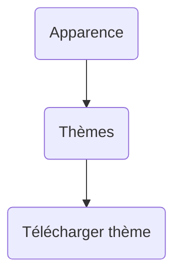
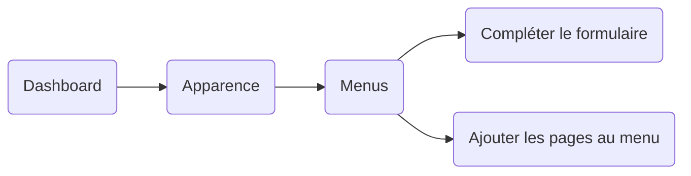
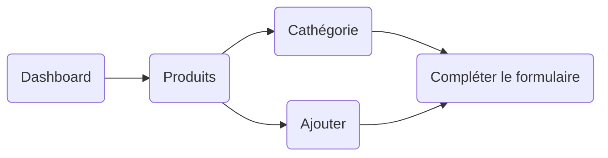
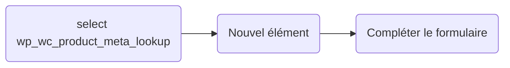
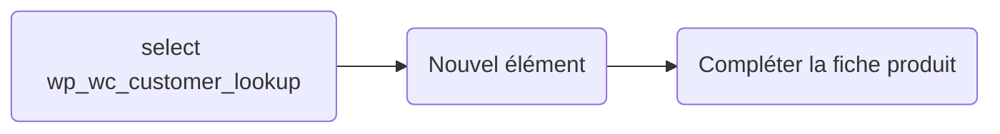
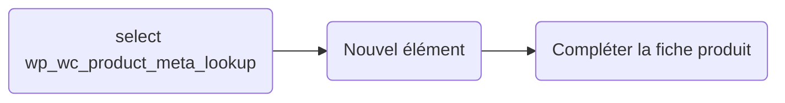

# Création d'un site d'e-commerce avec WordPress

Vous trouverez ici la création de mon site pour la boutique Tikalou, vente de produits Réunionnais, en utilisant WordPress.

##  Installation

Pour administrer son site Wordpress en local, on installe [LocalWP](https://localwp.com/). Ensuite, on se connecte à son compte Wordpress et on l'associe à un compte Flywheel.

##  Plugins installés

- **WooCommerce** : boîte à outil e-commerce
- **WooCommerce Shipping & Tax** : configuration des taxes, des étiquettes d'expédition et des paiements
- **Yoast SEO** : référencement
- **WP Forms** : création de formulaires (contact, newsletters,...)
- **Polylang** : gestion multilingues
- **Lingotek Translation** : localisation pour traduction
- **Jetpack** : sécurité et sauvegarde automatique
- **Complianz** : gestion RGPD et cookies

##  Thème 

Choisir un thème et le personnaliser.

##  Modification Menu

Méthode pour modifier le menu dans le dashboard de WordPress :

##  Ajouter des catégories et des produits

Les différentes méthodes pour modifier les catégories et les produits : 

- Dans le dashboard sur l'Admin de WordPress : 

- Dans la DataBase de Local (SQL) :

##  Créer des comptes clients et administrateurs

Méthode pour modifier créer des comptes clients : 

Les différentes méthodes pour créer des comptes administrateurs : 

- Dans le dashboard sur l'Admin de Wordpress : 

- Dans la DataBase de Local (SQL) :

